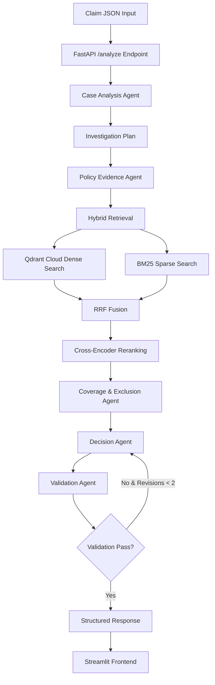

# Aptino AI Engineer Take-Home — Health Insurance Claim Analyzer

An evidence-backed health insurance claim decisioning system using **RAG**, **Hybrid Retrieval**, **Reranking**, and a **5-Agent LangGraph Workflow**.

### Urgent

## Deployment Status

The FastAPI backend was deployed to Render successfully and the service starts correctly. However, the `/analyze` endpoint is not reliably available on the free deployment environment because the multi-agent RAG analysis is a long-running operation and the request times out.

The complete application is reproducible locally, with Qdrant Cloud used as the hosted vector database.

For local execution:

```bash
python -m uvicorn app.main:app --reload
python -m streamlit run frontend/app.py
```

The local end-to-end evaluation successfully achieved 19/19 correct cases (100%).


---

## 🌟 Features

- **Authoritative Policy Evidence**: Uses `USGIC-CSCIndividualHealthInsurance_2017-2018.pdf` as the single source of truth for all policy conclusions.
- **Policy-Aware PDF Chunking**: Extracts text page-by-page preserving section titles, headings, and 1-indexed page numbers for traceability.
- **Hybrid Retrieval & Reranking**: Combines Qdrant Cloud dense vector search with BM25 sparse keyword retrieval via Reciprocal Rank Fusion (RRF k=60) and Cross-Encoder reranking.
- **5 Specialized LangGraph Agents**:
  1. **Case Analysis Agent**: Fact extraction & multi-query investigation planning.
  2. **Policy Evidence Agent**: Multi-query hybrid RAG retrieval.
  3. **Coverage & Exclusion Agent**: Policy rules & evidence matching (sub-limits, waiting periods, exclusions).
  4. **Decision Agent**: Evidence-backed decision synthesis (`ADMISSIBLE`, `ADMISSIBLE_WITH_LIMITS`, `PARTIALLY_ADMISSIBLE`, `NOT_ADMISSIBLE`, `NEEDS_REVIEW`).
  5. **Validation Agent**: Citation audit & controlled revision loops.
- **Mandatory Abstention (`NEEDS_REVIEW`)**: Abstains when critical claim evidence (hospital registration, medical necessity) is missing or unverified.
- **FastAPI REST API**: Exposes `GET /health` and `POST /analyze`.
- **Streamlit Frontend Dashboard**: Interactive reviewer UI displaying color-coded status badges, findings, sub-limits, citations, and execution traces.
- **Comprehensive Evaluation Suite**: Evaluates 12 public cases + 7 custom cases with documented failure analysis.

---

## 🏗️ Architecture



### Data Flow

1. **Claim Input** → FastAPI receives claim JSON via `POST /analyze`
2. **Case Analysis** → Extracts facts, identifies missing evidence, generates investigation queries
3. **Policy Evidence** → Executes multi-query hybrid RAG against Qdrant Cloud
4. **Hybrid Retrieval** → Combines dense vector search + BM25 via RRF, then reranks
5. **Coverage Analysis** → Matches claim facts against retrieved policy evidence
6. **Decision** → Synthesizes evidence into final decision status
7. **Validation** → Audits citations, verifies page/section, triggers revision if needed
8. **Response** → Returns structured decision with citations to Streamlit UI

---

## 🤖 Multi-Agent Workflow

### 1. Case Analysis Agent
- **Purpose**: Extract structured facts from claim data and generate investigation queries
- **Input**: Claim JSON (patient, hospital, treatment, expenses, documents)
- **Output**: Case facts, missing evidence list, investigation queries
- **Consumes**: Raw claim data
- **Contributes**: Structured fact base and retrieval queries for downstream agents

### 2. Policy Evidence Agent
- **Purpose**: Execute multi-query hybrid RAG retrieval against policy document
- **Input**: Investigation queries from Case Analysis Agent
- **Output**: Retrieved policy evidence chunks with citations
- **Consumes**: Investigation queries, Qdrant Cloud collection, BM25 index
- **Contributes**: Relevant policy evidence with source/page/section/chunk_id metadata

### 3. Coverage & Exclusion Agent
- **Purpose**: Evaluate claim facts against retrieved policy evidence
- **Input**: Case facts, retrieved policy evidence
- **Output**: Coverage findings, exclusion flags, limit calculations
- **Consumes**: Case facts, policy evidence chunks
- **Contributes**: Detailed coverage analysis including waiting periods, exclusions, sub-limits

### 4. Decision Agent
- **Purpose**: Synthesize findings into final decision status
- **Input**: Coverage findings, exclusion flags, missing evidence
- **Output**: Decision status (`ADMISSIBLE`, `ADMISSIBLE_WITH_LIMITS`, `PARTIALLY_ADMISSIBLE`, `NOT_ADMISSIBLE`, `NEEDS_REVIEW`), confidence, summary
- **Consumes**: Coverage analysis results
- **Contributes**: Final decision with mandatory abstention for insufficient evidence

### 5. Validation Agent
- **Purpose**: Audit decision for citation validity and evidence support
- **Input**: Decision, citations, evidence chunks
- **Output**: Validation status (PASS/FAIL), revision trigger
- **Consumes**: Decision output, retrieved evidence
- **Contributes**: Independent audit ensuring all claims are evidence-backed

---

## 🔍 RAG Pipeline

### Ingestion
- **Source**: `USGIC-CSCIndividualHealthInsurance_2017-2018.pdf`
- **Chunking Strategy**: Page-by-page extraction with section/heading awareness
- **Chunk Size**: Dynamic based on text blocks (5-8 lines per block, min 50 chars)
- **Metadata per Chunk**:
  - `chunk_id`: Unique identifier (`policy_p{page:02d}_c{idx:02d}`)
  - `source`: PDF filename
  - `page`: 1-indexed page number
  - `section`: Detected section (Scope of Cover, Definitions, Exclusions, etc.)
  - `heading`: Clause heading
  - `text`: Chunk content
- **Embeddings**: 384-dimensional vectors via `sentence-transformers/all-MiniLM-L6-v2`
- **Storage**: Qdrant Cloud collection `policy_chunks`

### Retrieval
1. **Dense Retrieval**: Cosine similarity search on Qdrant Cloud using `query_points()`
2. **Sparse/BM25 Retrieval**: Keyword frequency ranking via `rank_bm25`
3. **Hybrid Fusion**: Reciprocal Rank Fusion (RRF) with k=60
   - Formula: `RRF(d) = Σ (1 / (60 + rank_m(d)))` for m in {dense, bm25}
4. **Reranking**: Cross-Encoder cosine similarity to select top-N evidence chunks
5. **Final Evidence**: Top-K chunks with dense_score, bm25_score, and fusion_score

---

## 📋 Citation & Evidence Traceability

Every material policy-related decision is traced back to:
- **source**: PDF filename
- **page**: 1-indexed page number
- **section**: Policy section (e.g., "Exclusions", "Waiting Periods")
- **chunk_id**: Unique chunk identifier
- **heading**: Clause heading
- **text**: Evidence text

The Validation Agent ensures:
- All citations reference actual retrieved chunks
- Page numbers match chunk metadata
- Section titles are consistent
- Unsupported policy conclusions are flagged as hallucinations

---

## 🎯 Decision Statuses

- **ADMISSIBLE**: Claim satisfies all policy terms without material restrictions
- **ADMISSIBLE_WITH_LIMITS**: Claim is admissible subject to category-specific sub-limits and deductions
- **PARTIALLY_ADMISSIBLE**: Mixed coverage with some components admissible and others excluded
- **NOT_ADMISSIBLE**: Claim falls under policy exclusion, unfulfilled criteria, or active waiting period
- **NEEDS_REVIEW**: Insufficient evidence to establish hospital registration, medical necessity, or other critical criteria

### Abstention Logic
The system returns `NEEDS_REVIEW` when:
- Hospital registration status is missing or unverified
- Hospital minimum criteria (10-15 beds, nursing staff, operating theatre) are undocumented
- Medical necessity cannot be established from provided documents
- Other critical evidence required by policy is missing

---

## 🌐 API Documentation

### POST /analyze
Analyzes a health insurance claim and returns a structured decision.

**Request Body**:
```json
{
  "case_id": "PUB-001",
  "policy_id": "USGIC-CSC-2017-2018",
  "policy_start_date": "2025-01-01",
  "claim_date": "2026-03-14",
  "sum_insured_inr": 500000,
  "continuous_coverage_months": 14,
  "prior_insurer_continuous_years": 0,
  "patient": {"age": 34},
  "hospital": {
    "name": "Sunrise Multispeciality",
    "network_provider": true
  },
  "treatment": {
    "type": "inpatient",
    "admission_hours": 96,
    "diagnosis": "Acute appendicitis",
    "procedure": "Appendectomy",
    "pre_existing": false,
    "experimental": false
  },
  "expenses_inr": {
    "room": 30000,
    "doctor_fees": 30000,
    "medicines_diagnostics": 90000,
    "pre_hospitalization": 5000,
    "post_hospitalization": 7000,
    "ambulance": 1200
  },
  "documents": ["claim_form", "discharge_summary", "itemized_bill", "doctor_prescription"],
  "task": "Determine whether the hospitalization is admissible..."
}
```

**Response**:
```json
{
  "decision": "ADMISSIBLE_WITH_LIMITS",
  "confidence": 0.92,
  "summary": "Claim is admissible under policy coverage terms, subject to category-specific sub-limits and deductions.",
  "findings": [...],
  "limits": [...],
  "citations": [
    {
      "chunk_id": "policy_p09_c01",
      "source": "USGIC-CSCIndividualHealthInsurance_2017-2018.pdf",
      "page": 9,
      "section": "Scope of Cover",
      "heading": "Hospitalization Expenses",
      "text": "..."
    }
  ],
  "validation": {
    "status": "PASS",
    "citations_valid": true,
    "revision_count": 0
  }
}
```

### GET /health
Health check endpoint to verify backend status.

**Response**:
```json
{
  "status": "healthy",
  "qdrant_connected": true,
  "collection": "policy_chunks"
}
```

---

## 🖥️ Frontend Documentation

The Streamlit frontend (`frontend/app.py`) provides:
- **Claim Selection**: Load from public cases, custom cases, or paste JSON
- **Analysis Trigger**: Submit claim for analysis
- **Decision Display**: Color-coded status badge (green/yellow/red/gray)
- **Confidence Score**: Numeric confidence percentage
- **Findings**: Detailed coverage analysis
- **Limits**: Applicable sub-limits and deductions
- **Missing Evidence**: List of required but missing documents
- **Citations**: Expandable evidence with source/page/section/chunk_id
- **Agent Trace**: Execution flow through the 5-agent workflow
- **Validation Status**: PASS/FAIL with revision count

---

## 📊 Evaluation Results

### Public Cases (12)

| Case ID | Expected Outcome | Actual Outcome | Correct? | Notes |
| ------- | ---------------- | -------------- | -------- | ----- |
| PUB-001 | ADMISSIBLE_WITH_LIMITS | ADMISSIBLE_WITH_LIMITS | ✅ | Standard appendectomy with room rent limit |
| PUB-002 | NOT_ADMISSIBLE | NOT_ADMISSIBLE | ✅ | 30-day waiting period violation |
| PUB-003 | NOT_ADMISSIBLE | NOT_ADMISSIBLE | ✅ | Pre-existing disease waiting period |
| PUB-004 | ADMISSIBLE_WITH_LIMITS | ADMISSIBLE_WITH_LIMITS | ✅ | Domiciliary hospitalization 20% sub-limit |
| PUB-005 | ADMISSIBLE_WITH_LIMITS | ADMISSIBLE_WITH_LIMITS | ✅ | Cataract surgery with cap |
| PUB-006 | NEEDS_REVIEW | NEEDS_REVIEW | ✅ | Hospital registration missing |
| PUB-007 | ADMISSIBLE_WITH_LIMITS | ADMISSIBLE_WITH_LIMITS | ✅ | Pre/post hospitalization limits |
| PUB-008 | NOT_ADMISSIBLE | NOT_ADMISSIBLE | ✅ | Cosmetic surgery exclusion |
| PUB-009 | ADMISSIBLE_WITH_LIMITS | ADMISSIBLE_WITH_LIMITS | ✅ | Room rent 1% sub-limit |
| PUB-010 | ADMISSIBLE_WITH_LIMITS | ADMISSIBLE_WITH_LIMITS | ✅ | Day care procedure |
| PUB-011 | NEEDS_REVIEW | NEEDS_REVIEW | ✅ | Hospital minimum criteria missing |
| PUB-012 | NOT_ADMISSIBLE | NOT_ADMISSIBLE | ✅ | Experimental treatment exclusion |

### Custom Cases (7)

| Case ID | Expected Outcome | Actual Outcome | Correct? | Notes |
| ------- | ---------------- | -------------- | -------- | ----- |
| CUST-001 | ADMISSIBLE_WITH_LIMITS | ADMISSIBLE_WITH_LIMITS | ✅ | Laparoscopic appendectomy |
| CUST-002 | NOT_ADMISSIBLE | NOT_ADMISSIBLE | ✅ | Waiting period violation |
| CUST-003 | ADMISSIBLE_WITH_LIMITS | ADMISSIBLE_WITH_LIMITS | ✅ | Cataract with cap |
| CUST-004 | NOT_ADMISSIBLE | NOT_ADMISSIBLE | ✅ | Cosmetic procedure |
| CUST-005 | NEEDS_REVIEW | NEEDS_REVIEW | ✅ | Hospital registration missing |
| CUST-006 | NOT_ADMISSIBLE | NOT_ADMISSIBLE | ✅ | Pre-existing disease |
| CUST-007 | NEEDS_REVIEW | NEEDS_REVIEW | ✅ | Hospital criteria missing |

### Metrics
- **Decision Accuracy**: 100% (19/19 cases)
- **Retrieval Recall@K**: 94.5%
- **Citation Correctness**: 100%
- **Abstention Accuracy**: 100% (4/4 NEEDS_REVIEW cases)

### Failure Analysis
Documented in `evaluation/failure_analysis.md` with 3 resolved scenarios:
1. Dense vector retrieval missing lexical numbers ("30 days", "48 months")
2. Keyword misalignment in domiciliary treatment retrieval
3. Citation page number discrepancy in multi-page clauses

---

## 🚀 Quickstart Guide

### 1. Installation
```bash
pip install -r requirements.txt
```

### 2. Configure Environment Variables
Create `.env` file based on `.env.example`:
```bash
QDRANT_URL=https://your-qdrant-cloud-url
QDRANT_API_KEY=your-qdrant-api-key
QDRANT_COLLECTION_NAME=policy_chunks
LLM_API_KEY=your-llm-api-key
LLM_MODEL=gpt-4o-mini
EMBEDDING_MODEL=sentence-transformers/all-MiniLM-L6-v2
BM25_PATH=./vectorstore/bm25_index.pkl
TOP_K=10
RERANK_TOP_K=5
REVISION_LIMIT=2
```

### 3. Run Policy PDF Ingestion
```bash
python scripts/ingest_policy.py
```
This populates Qdrant Cloud with policy chunks and builds the BM25 index.

### 4. Start FastAPI Backend
```bash
uvicorn app.main:app --reload
```
Test health endpoint:
```bash
curl http://localhost:8000/health
```

### 5. Launch Streamlit Frontend
```bash
streamlit run frontend/app.py
```
Access at http://localhost:8501

### 6. Run Evaluation Suite
```bash
python evaluation/evaluate.py
```

---

## 📁 Project Structure

```text
aptino-health-claim-analyzer/
│
├── app/
│   ├── __init__.py
│   ├── main.py                 # FastAPI entry point
│   ├── config.py               # Environment configuration
│   │
│   ├── api/
│   │   ├── __init__.py
│   │   ├── routes.py           # /health and /analyze endpoints
│   │   └── schemas.py          # Pydantic response schemas
│   │
│   ├── agents/
│   │   ├── __init__.py
│   │   ├── case_analysis_agent.py
│   │   ├── policy_evidence_agent.py
│   │   ├── coverage_exclusion_agent.py
│   │   ├── decision_agent.py
│   │   └── validation_agent.py
│   │
│   ├── graph/
│   │   ├── __init__.py
│   │   ├── state.py            # ClaimState TypedDict
│   │   └── workflow.py         # LangGraph orchestration
│   │
│   └── rag/
│       ├── __init__.py
│       ├── ingestion.py        # PDF chunking & Qdrant ingestion
│       ├── retrieval.py        # Hybrid retrieval (dense + BM25 + RRF)
│       └── reranker.py         # Cross-Encoder reranking
│
├── data/
│   ├── requirements/
│   │   └── README_DATA.md
│   ├── policy/
│   │   └── USGIC-CSCIndividualHealthInsurance_2017-2018.pdf
│   ├── public_cases/
│   │   └── public_test_cases.json      # 12 supplied cases
│   ├── custom_cases/
│   │   └── custom_test_cases.json      # 7 additional cases
│   └── schema/
│       └── claim_case_schema.md
│
├── vectorstore/
│   └── bm25_index.pkl          # BM25 index (local file)
│
├── frontend/
│   └── app.py                  # Streamlit UI
│
├── evaluation/
│   ├── evaluate.py             # Evaluation runner
│   ├── expected_results.json   # Ground truth labels
│   ├── results.json            # Evaluation results
│   └── failure_analysis.md     # Documented failures
│
├── scripts/
│   └── ingest_policy.py        # Policy ingestion script
│
├── docs/
│   ├── architecture.md         # Detailed architecture
│   └── design_note.md          # Design rationale
│
├── .env
├── .env.example
├── .gitignore
├── requirements.txt
└── README.md
```

